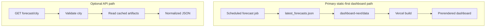
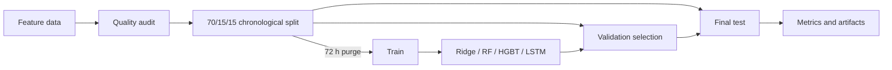
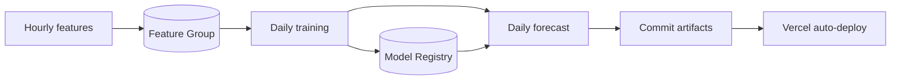

# AQI Predictor

> An end-to-end machine-learning system that produces 24-, 48-, and 72-hour US AQI forecasts for Karachi, Lahore, and Islamabad.

[Architecture](#system-architecture) · [Data](#data-pipeline) · [Models](#machine-learning-system) · [API](#fastapi-service) · [Automation](#automation-and-mlops) · [Setup](#local-development) · [Status](#current-implementation-status)

## Project overview

AQI Predictor turns hourly weather and air-quality observations into three direct future AQI estimates per city. Users can inspect cached observations, compare future air-quality conditions, review model evidence, and examine feature-level explanations. It is an engineering and decision-support project, not a regulatory monitoring or public-health alerting service.

The repository implements collection, validation, feature engineering, Hopsworks integration, model training, evaluation, SHAP generation, forecasting, artifact publication, and a Next.js dashboard. The primary dashboard is **static-first**: GitHub Actions refreshes JSON/CSV artifacts and commits them for a Vercel rebuild. A FastAPI service is also implemented for optional API-backed deployments, but the current dashboard reads build-time artifacts rather than calling it.

## Key features

- Hourly Open-Meteo weather and air-quality acquisition with chunking, retries, timeouts, and raw-response caching.
- Direct multi-output US AQI regression at +24, +48, and +72 hours for three Pakistani cities.
- City-isolated calendar, lag, rolling, EMA, change, ratio, interaction, wind, and episode features.
- Leakage-aware chronological train/validation/test splitting with a 72-hour purge.
- Ridge, Random Forest, histogram gradient boosting, and TensorFlow LSTM implementations plus persistence baselines.
- Hopsworks Feature Group, Feature View, Training Dataset, and Model Registry adapters.
- Generated evaluation, quality, leakage, forecast, and Random Forest SHAP artifacts.
- Static Next.js 16 dashboard and an optional FastAPI cached-forecast service.
- Hourly feature, daily training, and daily forecast GitHub Actions workflows.

## System architecture

```mermaid
flowchart LR
    OM[Open-Meteo APIs] --> COL[Python collectors]
    COL --> CLEAN[Merge, validate, clean]
    CLEAN --> FE[Feature engineering]
    FE --> HW[(Hopsworks Feature Group v1)]
    HW --> FV[Feature View and Training Dataset v1]
    FV --> TRAIN[Train and evaluate]
    TRAIN --> REG[(Hopsworks Model Registry)]
    REG --> PRED[24/48/72 h batch prediction]
    PRED --> ART[JSON and CSV artifacts]
    ART --> SYNC[Frontend artifact sync]
    SYNC --> WEB[Next.js static dashboard]
    REG -. optional serving .-> API[FastAPI]
```



### Publication and API paths



The API serves cached batch artifacts; it does not infer per HTTP request. Its model loader verifies a pinned Hopsworks model artifact before deserialization.

## Repository structure

```text
10PEARLS/
├── .github/workflows/       # Hourly features, daily training and forecasts
├── api/index.py             # Thin FastAPI deployment entry point
├── artifacts/               # Metrics, forecasts, quality and SHAP evidence
├── config/                  # Cities, variables, horizons and model settings
├── dashboard-next/          # Next.js application and presentation data
├── data/                    # Ignored raw/processed data locations
├── docs/                    # Technical report and deployment guidance
├── scripts/                 # Backfill, feature, training and forecast utilities
├── src/
│   ├── api/                 # FastAPI application
│   ├── data/                # Open-Meteo client, cleaning and validation
│   ├── eda/                 # Optional EDA artifact generation
│   ├── explainability/      # SHAP analysis
│   ├── feature_store/       # Hopsworks integration
│   ├── features/            # Feature engineering and quality audit
│   ├── model_serving/       # Registry download and integrity checks
│   ├── prediction/          # Batch prediction and AQI categorization
│   └── training/            # Models, splits, baselines and evaluation
├── tests/                   # Python tests
├── Dockerfile               # Python API image (port 7860)
├── render.yaml              # Render API blueprint
└── pyproject.toml           # Python dependency source of truth
```

## Data sources and supported cities

The implementation uses Open-Meteo exclusively; AQICN and OpenWeather are not used.

| Source | Use | Data | Authentication | Behavior |
|---|---|---|---|---|
| Historical Weather API | Training and recent observations | Temperature, humidity, dew point, precipitation, pressure, clouds, wind | None | 90-day chunks, four retries, request-hash cache. |
| Air Quality API | Training and recent observations | PM10, PM2.5, CO, NO₂, SO₂, ozone, US AQI | None | Same retry/validation path; archive availability may lag. |
| Forecast APIs | Dashboard weather outlook | Future weather and air-quality context | None | Separate from the ML model inputs. |

No provider fallback dataset is implemented. Committed artifacts let the static dashboard build if refresh fails, but can become stale.

| City | Country | Historical data | Recent context | Prediction |
|---|---|---:|---:|---:|
| Karachi | Pakistan | Yes | Yes | 24/48/72 h |
| Lahore | Pakistan | Yes | Yes | 24/48/72 h |
| Islamabad | Pakistan | Yes | Yes | 24/48/72 h |

## Data pipeline

1. `scripts/historical_backfill.py` fetches hourly weather and air-quality frames and inner-joins them on city, coordinates, and timestamp.
2. Validation checks schema, timezone awareness, duplicate keys, missing hours, physical ranges, and infinities.
3. Cleaning removes invalid timestamps/duplicates, converts out-of-range values to missing, and interpolates only internal numeric gaps up to three hours within each city.
4. Feature engineering sorts by city/time and creates city-grouped temporal signals. It does not normalize the full dataset before splitting.
5. The pipeline can write Parquet locally and/or upsert `aqi_features` v1 in Hopsworks.
6. Training reads local data or `aqi_prediction_view` v1, audits features, splits chronologically, and fits preprocessing only on training data.
7. `scripts/predict.py` selects each city's newest row and emits direct predictions to `artifacts/latest_forecasts.json`.

The committed quality artifact records 105,912 cleaned hourly rows from 1 August 2022 through 10 August 2026, 358 candidate features, 354 selected features, no duplicate timestamps, and no missing hourly timestamps. These are artifact results, not guarantees about future refreshes.

### Feature families

| Family | Examples | Source |
|---|---|---|
| Raw | AQI, pollutants, temperature, humidity, pressure, precipitation, wind | Open-Meteo |
| Calendar/cyclical | hour, weekday, month, season, sine/cosine encodings | UTC timestamp |
| Lags | AQI through 168 h; pollutants through 72 h; weather through 24 h | City history |
| Rolling/EMA | mean/min/max/std over 3–168 h; AQI/PM2.5 EMA over 3–72 h | City history |
| Change | absolute and percentage change over selected horizons | Current and lagged values |
| Interactions | pollutant ratios, weather×pollutant products, wind vectors | Engineered |
| Episode/dispersion | high-pollution flags, streaks, boundary stability, ventilation | Engineered |

See `artifacts/feature_manifest.csv` and `artifacts/feature_quality_report.csv` for the generated inventory.

## Machine-learning system

The production selection artifact names **Random Forest** as the model chosen on validation RMSE. One multi-output scikit-learn pipeline maps the latest feature vector directly to three numeric US AQI values; negative outputs are clipped to zero.

Candidates are Ridge, Random Forest, histogram gradient boosting, and a bidirectional/LSTM TensorFlow network. The selected daily workflow retrains Ridge, a fixed validation-selected Random Forest, and a 48-step LSTM. HGBT remains implemented for broader local runs but is skipped by `--selected-configuration`. Persistence and seasonal persistence are non-learned baselines.



### Verified results

RMSE and MAE are US AQI points. R² is variance explained, not accuracy.

| Model | Validation RMSE | Validation MAE | Validation R² |
|---|---:|---:|---:|
| Random Forest (selected) | 22.853 | 16.989 | 0.669 |
| Ridge | 22.922 | 16.807 | 0.665 |
| LSTM | 23.946 | 17.873 | 0.639 |
| Persistence | 27.581 | 19.011 | 0.518 |
| Seasonal persistence | 31.551 | 22.441 | 0.377 |

| Random Forest final test | RMSE | MAE | R² |
|---:|---:|---:|---:|
| 24 h | 19.072 | 13.327 | 0.824 |
| 48 h | 24.702 | 17.588 | 0.704 |
| 72 h | 26.339 | 19.009 | 0.662 |

Full results are in `artifacts/model_comparison.csv`, `artifacts/city_metrics.csv`, and `artifacts/baseline_test_metrics.csv`.

### Three-day forecast

This is direct multi-horizon regression, not recursive hourly simulation or daily averaging. The model consumes the newest engineered row and returns AQI at exactly +24, +48, and +72 hours. Future weather shown in the dashboard is contextual and is not model input.

| US AQI | Category |
|---:|---|
| 0–50 | Good |
| 51–100 | Moderate |
| 101–150 | Unhealthy for Sensitive Groups |
| 151–200 | Unhealthy |
| 201–300 | Very Unhealthy |
| >300 | Hazardous |

### Explainability

Training generates Random Forest SHAP summary plots for all horizons, a horizon-specific importance CSV, and one signed local 24-hour explanation. The dashboard reads these exports; SHAP is not calculated during web requests. HGBT explanation support also exists but is not invoked by the current training script.

## FastAPI service

The optional service lives in `src/api/app.py` and is re-exported by `app.py` and `api/index.py`.

| Method | Endpoint | Purpose |
|---|---|---|
| GET | `/health` | Model/artifact readiness (`ok` or `degraded`). |
| GET | `/cities` | Supported city names. |
| GET | `/forecast/{city}` | Cached forecasts and latest cached observation. |
| GET | `/model-info` | Selected-model validation and final-test metadata. |

```bash
curl http://127.0.0.1:8000/forecast/Karachi
```

```json
{
  "city": "Karachi",
  "data_status": "cached",
  "forecasts": {
    "24h": {"aqi": 88.4, "category": "Moderate", "timestamp": "<ISO-8601>"},
    "48h": {"aqi": 91.2, "category": "Moderate", "timestamp": "<ISO-8601>"},
    "72h": {"aqi": 93.1, "category": "Moderate", "timestamp": "<ISO-8601>"}
  }
}
```

The numbers illustrate schema only. Unsupported cities return 404; missing artifacts return 503. CORS origins are explicit, methods are GET-only, and model loading requires a valid SHA-256 digest.

## Frontend

`dashboard-next/` uses Next.js 16 App Router, React 19, TypeScript, Recharts, Motion, and Lucide. Routes include `/`, `/dashboard`, `/models`, `/methodology`, and `/about`. It presents city forecasts, observations, pollutants/weather, comparisons, weather outlook, model evidence, data quality, MLOps status, and SHAP-derived feature intelligence. Missing artifact readers return empty fallbacks and route-level loading/error states exist.

`NEXT_PUBLIC_SITE_URL` controls canonical metadata. `NEXT_PUBLIC_API_BASE_URL` is used by an implemented API client module, but the current dashboard loader does not call it; setting it alone does not change the static data path.

## Automation and MLOps

| Workflow | Trigger | Responsibility | Secret |
|---|---|---|---|
| Hourly feature pipeline | Hourly at minute 17; manual | Build latest rows and asynchronously upsert Hopsworks | `HOPSWORKS_API_KEY` |
| Daily model training | 03:00 UTC; manual | Run tests, retrain selected candidates, generate evidence, register models | `HOPSWORKS_API_KEY` |
| Daily forecast → commit → redeploy | 05:00 UTC; manual; successful training | Predict, refresh observations, optionally export history, sync/commit artifacts | `HOPSWORKS_API_KEY`, `GITHUB_TOKEN` |



The hourly job does not wait for offline materialization/readback. Historical web export is allowed to fail when local Parquet is absent. A green forecast job therefore does not prove every optional output refreshed.

## Deployment

- **Vercel:** `dashboard-next/vercel.json` configures the static Next.js application; artifact commits can trigger redeployment.
- **Render:** `render.yaml` defines a FastAPI service and health check. Live deployment status is not verifiable from source.
- **Docker / Hugging Face Spaces:** the root image runs FastAPI on port 7860 and downloads its pinned Hopsworks model. An active Space is not verifiable here.
- **Hopsworks:** code supports feature storage, training retrieval, model registration, and model download. Remote state was not re-queried for this update.

## Environment variables

| Variable | Used by | Purpose |
|---|---|---|
| `HOPSWORKS_API_KEY` | Pipelines/API | Secret Hopsworks credential. |
| `HOPSWORKS_PROJECT` | Pipelines/API | Project name; defaults to `DataProject`. |
| `MODEL_NAME` | Prediction/API | Model name; defaults to `aqi_random_forest`. |
| `MODEL_VERSION` | Prediction/API | Pinned integer or `latest`; defaults to `1`. |
| `MODEL_SHA256` | Model loader | Trusted model digest. |
| `MODEL_CACHE_DIR` | Model loader | Download/cache directory. |
| `ALLOWED_ORIGINS` / `CORS_ORIGINS` | FastAPI | Exact browser origins. |
| `ALLOWED_ORIGIN_REGEX` | FastAPI | Optional scoped preview regex. |
| `LOG_LEVEL` | FastAPI | Logging level. |
| `LOAD_MODEL_ON_STARTUP` | FastAPI | Load model during startup when `1`. |
| `NEXT_PUBLIC_API_BASE_URL` | Next.js API client | Optional FastAPI base URL. |
| `NEXT_PUBLIC_SITE_URL` | Next.js | Canonical metadata URL. |

`.env` is ignored and untracked. Never expose Hopsworks secrets through `NEXT_PUBLIC_*` variables.

## Local development

```powershell
git clone https://github.com/sharjeel435/10PearlsProject.git
cd 10PearlsProject
py -3.12 -m venv .venv
.venv\Scripts\Activate.ps1
pip install -e ".[dev,hopsworks,lstm,explain,app]"
Copy-Item .env.example .env
```

Python 3.12 is used by workflows; `pyproject.toml` declares 3.11–3.14.

```powershell
python -m scripts.historical_backfill --output data/processed/aqi_features_full.parquet
python -m scripts.historical_backfill --upload
python -m scripts.train_models --input data/processed/aqi_features_full.parquet
python -m scripts.train_models --hopsworks --register --selected-configuration
python -m scripts.predict --latest
python -m scripts.refresh_observations
```

Hopsworks commands require `HOPSWORKS_API_KEY`. Explicit local prediction requires a trusted model digest sidecar.

```powershell
uvicorn src.api.app:app --host 127.0.0.1 --port 8000
```

```powershell
cd dashboard-next
npm ci
npm run dev
```

## Testing and verification

```powershell
python -m pytest -q
npm --prefix dashboard-next test
npm --prefix dashboard-next run typecheck
npm --prefix dashboard-next run lint
npm --prefix dashboard-next run build
```

Verified on 26 August 2026: **58 Python tests passed** (three dependency deprecation warnings), **24 frontend tests passed**, TypeScript and ESLint passed, and the production build prerendered all seven routes. Live Open-Meteo/Hopsworks/cloud availability is not proven by these isolated checks.

## Current implementation status

| Component | Status | Notes |
|---|---|---|
| Data collection | ✅ Implemented | Open-Meteo; no secondary provider fallback. |
| Validation/cleaning | ✅ Implemented | Range, schema, continuity and short-gap handling. |
| Feature engineering | ✅ Implemented | 354 selected features in current evidence. |
| Feature store | ✅ Implemented | Hopsworks adapters; remote state requires credentials. |
| Training/evaluation | ✅ Implemented | Scikit-learn, TensorFlow, baselines and purged splits. |
| Three-day forecasting | ✅ Implemented | Direct +24/+48/+72-hour point forecasts. |
| Explainability | ✅ Implemented | Offline RF SHAP exports. |
| FastAPI | ✅ Implemented | Cached serving and verified model loading. |
| Next.js dashboard | ✅ Implemented | Static artifact path; API client is not the main loader. |
| Automation | ⚠️ Partial | Workflows exist; live run/secret status is unverified. |
| Deployment | ⚠️ Partial | Configs exist; active cloud status is unverified. |
| Drift monitoring/alerts | ❌ Not implemented | Quality artifacts are not a live monitoring service. |

## Limitations

- Point forecasts have no prediction intervals or calibrated uncertainty.
- Future weather is displayed but is not an ML input.
- Only three cities are modeled; performance varies by city and horizon.
- Open-Meteo data and US AQI calculation are external dependencies and can lag.
- Static publication can display stale data between successful workflow runs.
- API startup depends on Hopsworks and a trusted digest when model loading is enabled.
- No drift service, alerts, authentication, rate limiting, or probabilistic forecasting exists.

## Future work

Add uncertainty intervals, forecast-weather covariates, rolling backtests, drift/freshness alerts, API authentication and rate limits, model promotion gates, more cities, and ground-station validation. Advanced sequence or ensemble models should be adopted only if they outperform the current baselines and Random Forest under the same leakage-safe evaluation.

## Further documentation

- [Final technical report](docs/AQI_PROJECT_REPORT.md)
- [Deployment guide](docs/DEPLOYMENT.md)

## Responsible use

These are model estimates from third-party environmental data. They do not replace official monitoring stations, health authority guidance, or emergency alerts.
