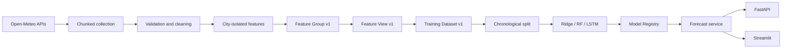

# Pearls AQI Predictor

Production-grade hourly AQI forecasting for Islamabad, Karachi, and Lahore. The system uses real Open-Meteo weather and air-quality observations, predicts US AQI 24/48/72 hours ahead, stores reproducible features in Hopsworks, and serves the selected model through FastAPI and Streamlit.

## Verified state (15 August 2026)

- 105,912 clean hourly city rows from 1 August 2022 through 10 August 2026 (35,304 per city).
- No duplicate keys or timestamp gaps; 100 physically invalid source values were converted to missing before imputation.
- 362 stored columns: timestamp, 354 selected predictors, three targets, and four audited exclusions.
- Hopsworks Feature Group `aqi_features` v1 and Feature View `aqi_prediction_view` v1 were read live; local retrained artifacts remain unregistered until an explicitly approved registry update.
- Ridge, Random Forest, and LSTM were retrained locally with 72-hour partition purges and reload successfully with matching integrity metadata.
- Random Forest is selected by leakage-safe validation RMSE (22.853); persistence is 27.581. The retrained LSTM remains behind RF but improves substantially (validation RMSE 23.946).
- 50 Python tests and 8 frontend tests pass; frontend lint, typecheck, and production build also pass.

## Architecture



All temporal features and targets are calculated inside city groups. Targets are shifts at +24/+48/+72 hours and are rejected from inputs. Imputers and scalers fit only on training data; test data is reserved for final evaluation.

## Model evidence

### Validation set (used for model selection)

| Model | 24h RMSE | 48h RMSE | 72h RMSE | Overall RMSE | MAE | R² |
|---|---:|---:|---:|---:|---:|---:|
| Random Forest | 18.495 | 24.164 | 25.901 | **22.853** | 16.989 | 0.669 |
| Ridge | 17.959 | 24.607 | 26.199 | 22.922 | **16.807** | 0.665 |
| Persistence | 22.330 | 28.780 | 31.633 | 27.581 | 19.011 | 0.518 |
| Seasonal persistence | 28.835 | 31.643 | 34.176 | 31.551 | 22.441 | 0.377 |
| LSTM | 20.117 | 24.940 | 26.782 | 23.946 | 17.873 | 0.639 |

### Final test set (chronological hold-out, never used for selection or tuning)

| Model | 24h RMSE | 24h R² | 48h RMSE | 48h R² | 72h RMSE | 72h R² | Mean R² |
|---|---:|---:|---:|---:|---:|---:|---:|
| Random Forest | **19.072** | **0.824** | **24.702** | **0.704** | **26.339** | **0.662** | **0.730** |
| Ridge | 18.600 | 0.833 | 26.085 | 0.669 | 27.862 | 0.621 | 0.708 |
| LSTM | 21.379 | 0.777 | 25.300 | 0.686 | 27.164 | 0.636 | 0.700 |

Note: R² here is the coefficient of determination — not a classification accuracy. Full per-city test metrics are in `artifacts/city_metrics.csv`. Fresh RF SHAP summary plots and importance columns exist independently for 24h, 48h, and 72h.


## Setup and run

Python 3.12 is the verified training runtime. The package supports Python 3.11–3.14.

```powershell
py -3.12 -m venv .venv
.venv\Scripts\Activate.ps1
pip install -e ".[dev,hopsworks,lstm,explain,app]"
Copy-Item .env.example .env

python -m scripts.historical_backfill --output data/processed/aqi_features_full.parquet
python -m scripts.historical_backfill --upload
python -m scripts.run_feature_pipeline --upload
python -m scripts.train_models --hopsworks --register
python -m scripts.predict --latest

uvicorn src.api.app:app --host 0.0.0.0 --port 8000
streamlit run dashboard/app.py
pytest -q
```

Set `HOPSWORKS_API_KEY` only in the ignored `.env` or CI secret store. API routes are `/health`, `/cities`, `/forecast/{city}`, and `/model-info`; invalid cities return 404.

## Automation and security

GitHub Actions runs incremental features hourly and versioned training daily, with manual dispatch available. Model loading is restricted to the trusted `artifacts/` tree and verifies a SHA-256 sidecar before joblib deserialization. `.env`, datasets, caches, and generated models are ignored.

## Known limitations

- The Hopsworks materialization job reported failure after a Prometheus PushGateway timeout, but direct server read verified all 105,912 rows. The Windows Arrow/HDFS client could not reliably download the full Training Dataset, so the local model run used the byte-identical validated parquet uploaded to Hopsworks. Linux CI consumes Training Dataset v1 directly.
- Open-Meteo archive availability trails real time; the latest source observation in this run is 10 August 2026.

## Next.js intelligence dashboard

The full A-to-Z operational interface reads the latest verified files under `artifacts/` directly on the server, so retraining and forecast runs appear without duplicating metrics in frontend code.

```bash
cd dashboard-next
npm install
npm run dev
```

Open `http://localhost:3000`. The dashboard includes city forecasts, validation and final-test model results, data quality, feature families, SHAP importance, leakage controls, Hopsworks architecture, automation, reload checks, and audit readiness.

## Web Application

The production web application lives in `dashboard-next/` and uses Next.js 15, TypeScript, App Router, Lucide and Recharts. Routes are `/`, `/dashboard`, `/models`, `/methodology`, and `/about`. It never trains models or recomputes SHAP during a request.

## Local Frontend Setup

```bash
cd dashboard-next
copy .env.example .env.local
npm ci
npm run typecheck
npm run lint
npm run test
npm run dev
```

Set `NEXT_PUBLIC_API_BASE_URL=http://127.0.0.1:8000` for API-backed deployments. The checked-in local artifact view is timestamped and never presented as a fabricated live feed.

## FastAPI Setup

```bash
python -m uvicorn src.api.app:app --host 127.0.0.1 --port 8000
```

The thin `api/index.py` deployment entrypoint imports the same application. It does not duplicate API logic. Configure `CORS_ORIGINS` as a comma-separated list of permitted frontend origins.

## Vercel Deployment

Use `dashboard-next` as the Vercel Root Directory. The verified production architecture is split deployment because the Random Forest artifact is approximately 475 MB before Python runtime dependencies.

```text
Vercel: Next.js frontend
External ML host: FastAPI + Random Forest artifact
```

Build command: `npm run build`. Install command: `npm ci`. No `vercel.json` is required because framework defaults are sufficient.

## Environment Variables

| Variable | Scope | Required | Purpose |
|---|---|---:|---|
| `NEXT_PUBLIC_API_BASE_URL` | Browser-safe | Production | External FastAPI origin |
| `NEXT_PUBLIC_SITE_URL` | Browser-safe | Recommended | Canonical metadata origin |
| `CORS_ORIGINS` | FastAPI server | Production | Allowed frontend origins |
| `HOPSWORKS_API_KEY` | Backend only | Pipeline | Never expose to Next.js |

## Preview Deployment

Set `NEXT_PUBLIC_API_BASE_URL` to a staging API and add the generated Vercel preview origin to the staging API's `CORS_ORIGINS`. Do not point preview deployments at production unless intentionally approved.

## Production Deployment

Set the production API origin and canonical site URL in Vercel, then import the repository with `dashboard-next` as Root Directory. Deployment is manual; this repository does not invoke `vercel --prod`.

## Deployment Architecture

Option A, full Vercel, retains `api/index.py` for compatibility experiments but is not recommended for the current 475 MB RF artifact. Option B, split deployment, is the verified selection and requires no frontend code change—only `NEXT_PUBLIC_API_BASE_URL`.

## Troubleshooting

- “API origin is not configured”: set `NEXT_PUBLIC_API_BASE_URL`.
- Browser CORS error: add the exact frontend origin to backend `CORS_ORIGINS`.
- Forecast unavailable: confirm `/health` and `/forecast/Karachi` on the API.
- Vercel cannot find the app: set Root Directory to `dashboard-next`.
- Stale forecast: compare `generated_at` and `latest_observation.timestamp`; do not treat either as wall-clock current.
- LSTM does not beat persistence and is not selected for serving.
- The supplied directory has no Git metadata, so commit history and clean-tree status cannot be audited.

See `artifacts/audit_report.md` for the A-to-Z audit findings and `artifacts/best_model.json` for the structured validation_metrics / final_test_metrics split.
